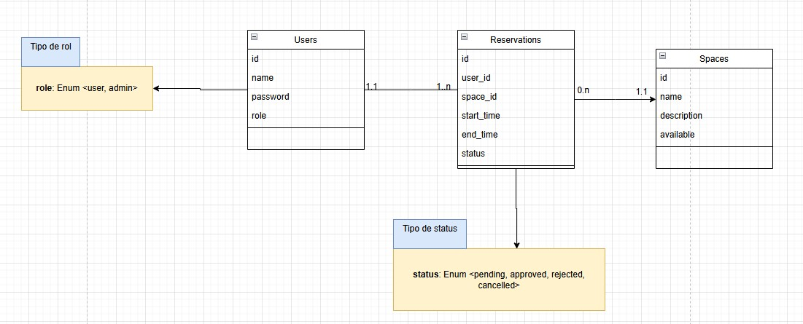

# API de Reservas - Laravel

Este proyecto es la parte del backend de un sistema de reservas, desarrollado como challenge técnico, utilizando Laravel 12 y Laravel Sanctum para autenticación basada en tokens.

## Requisitos

-   PHP >= 8.2
-   Composer
-   MySQL
-   Laravel 12
-   Laravel Sanctum

## Instalación y configuración

1. Clonar el repositorio:
   git clone https://github.com/tuusuario/reservas-api.git
   cd reservas-api

## Instalar las dependencias:

composer install

## Copia y configura el archivo de entorno:

cp .env.example .env
php artisan key:generate

## Configura la conexión a la base de datos en el archivo .env.

DB_CONNECTION=mysql
DB_HOST=127.0.0.1
DB_PORT=3306
DB_DATABASE=reservas
DB_USERNAME=root
DB_PASSWORD=secret

## Ejecuta las migraciones para crear las tablas en la base de datos:

php artisan migrate

## Inicia el servidor:

php artisan serve

## Notas adicionales

No se utiliza una tabla de slots ya que los horarios disponibles se calculan dinámicamente en función de:

La fecha seleccionada

El espacio o recurso a reservar

Las reservas existentes

La lógica de cálculo de disponibilidad se encuentra en ReservationController, y está diseñada para evitar solapamientos entre reservas.

Se utilizó Laravel Sanctum por su simplicidad para entornos SPA o aplicaciones móviles que consumen APIs vía token.

## Diseño de la Base de datos

  

**Nota:** 
- 📝 Consideración sobre el manejo de disponibilidad
El sistema podría haberse ampliado mediante una estructura más robusta utilizando una tabla slots para definir intervalos horarios disponibles y una tabla blocks para especificar franjas válidas por día (por ejemplo: de 10:00 a 14:00 y de 16:00 a 20:00).

Sin embargo, debido al tiempo del challenge de enrega y a las restricciones del enunciado, se optó por una solución más simple y funcional: la disponibilidad se calcula dinámicamente mediante un algoritmo en el backend, el cual genera los bloques posibles en un rango horario fijo predefinido. Esta lógica está implementada directamente en una función del controlador.
